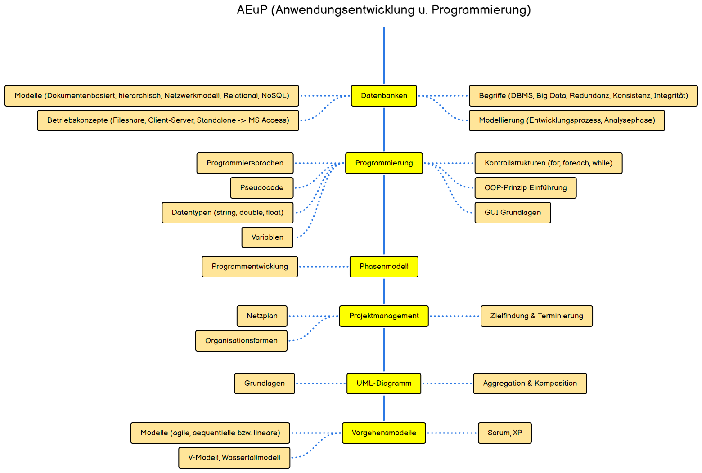

# Ausbildungsjahr 1

> [!TIP]
> Visit the complete roadmap [here](https://roadmap.sh/r/fachinformatiker)

## Elektrotechnik - IT-Technik

| Topic                                   | Description / Link                                                                                                                                                                                                                                                                                                                                         |
| --------------------------------------- | ---------------------------------------------------------------------------------------------------------------------------------------------------------------------------------------------------------------------------------------------------------------------------------------------------------------------------------------------------------- |
| Grundgatter (Logikgatter)               | Elektronische Schaltkreise, die als Grundlage für digitale Schaltungen dienen (z.B. AND, OR).                                                                                                                                                                                                                                                              |
|                                         | [https://www.elektroniktutor.de/digitaltechnik/gatter.html](https://www.elektroniktutor.de/digitaltechnik/gatter.html)                                                                                                                                                                                                                                     |
|                                         | [https://www.khanacademy.org/computing/computers-and-internet/xcae6f4a7ff015e7d:computers/xcae6f4a7ff015e7d:logic-gates-and-circuits/quiz/xcae6f4a7ff015e7d:computers-quiz-1](https://www.khanacademy.org/computing/computers-and-internet/xcae6f4a7ff015e7d:computers/xcae6f4a7ff015e7d:logic-gates-and-circuits/quiz/xcae6f4a7ff015e7d:computers-quiz-1) |
| KV Diagramm (Kamaugh-Veitch - Diagramm) | Ein Werkzeug zur Vereinfachung logischer Schaltungen in der digitalen Technik.                                                                                                                                                                                                                                                                             |
|                                         | [https://www.elektroniktutor.de/digitaltechnik/kvdiagr.html#:~:text=Ein%20KV%2DDiagramm%20ist%20eine,ergeben%20sich%20bereits%20minimierte%20Funktionsgleichungen](https://www.elektroniktutor.de/digitaltechnik/kvdiagr.html#:~:text=Ein%20KV%2DDiagramm%20ist%20eine,ergeben%20sich%20bereits%20minimierte%20Funktionsgleichungen).                      |
| Ampelsteuerung                          |                                                                                                                                                                                                                                                                                                                                                            |
|                                         | [https://www.elektroniktutor.de/regelungstechnik/regelung.html](https://www.elektroniktutor.de/regelungstechnik/regelung.html)                                                                                                                                                                                                                             |
|                                         |                                                                                                                                                                                                                                                                                                                                                            |
| Zahlensysteme                           | Verschiedene numerische Systeme wie Binär, Dezimal, Hexadezimal zur Darstellung von Zahlen.                                                                                                                                                                                                                                                                |
|                                         | [https://studyflix.de/informatik/zahlensysteme-402](https://studyflix.de/informatik/zahlensysteme-402)                                                                                                                                                                                                                                                     |
| Addierer                                |                                                                                                                                                                                                                                                                                                                                                            |
|                                         | [https://inf-schule.de/rechner/digitaltechnik/addierer/einstieg](https://inf-schule.de/rechner/digitaltechnik/addierer/einstieg)                                                                                                                                                                                                                           |

## Hardware & EDV - IT-Technik

| Topic                                  | Description / Link                                                                                                                                                                                                                                                                                                                                                                            |
| -------------------------------------- | --------------------------------------------------------------------------------------------------------------------------------------------------------------------------------------------------------------------------------------------------------------------------------------------------------------------------------------------------------------------------------------------- |
| Grundlagen der EDV                     | Basiswissen über elektronische Datenverarbeitung und die Funktionsweise von Computernetzen.                                                                                                                                                                                                                                                                                                   |
|                                        |                                                                                                                                                                                                                                                                                                                                                                                               |
| Das Mainboard                          | Die zentrale Leiterplatte eines Computers, auf der alle wichtigen Komponenten verbunden sind.                                                                                                                                                                                                                                                                                                 |
|                                        | [https://www.elektronik-kompendium.de/sites/com/0309231.htm](https://www.elektronik-kompendium.de/sites/com/0309231.htm)                                                                                                                                                                                                                                                                      |
| Bus-Systeme                            | Datenübertragungssysteme, die Komponenten eines Computers miteinander verbinden.                                                                                                                                                                                                                                                                                                              |
|                                        | [https://studyflix.de/informatik/bus-system-6108](https://studyflix.de/informatik/bus-system-6108)                                                                                                                                                                                                                                                                                            |
| Die CPU (Central Processing Unit)      | Die zentrale Recheneinheit eines Computers, die alle wichtigen Berechnungen durchführt.                                                                                                                                                                                                                                                                                                       |
|                                        | [https://simpleclub.com/lessons/informatik-prozessor](https://simpleclub.com/lessons/informatik-prozessor)                                                                                                                                                                                                                                                                                    |
|                                        | [https://studyflix.de/informatik/was-ist-cpu-7425](https://studyflix.de/informatik/was-ist-cpu-7425)                                                                                                                                                                                                                                                                                          |
| Speicherarten                          | Unterschiedliche Typen von Datenspeichern wie SSD, HDD, RAM, die für verschiedene Zwecke verwendet werden.                                                                                                                                                                                                                                                                                    |
|                                        | [https://simpleclub.com/lessons/informatik-der-speicher](https://simpleclub.com/lessons/informatik-der-speicher)                                                                                                                                                                                                                                                                              |
|                                        | [https://www.computerweekly.com/de/definition/Speichermedien](https://www.computerweekly.com/de/definition/Speichermedien)                                                                                                                                                                                                                                                                    |
| Gehäuse, Netzteile u. Energieverbrauch | Komponenten eines Computers, die das System schützen und mit Strom versorgen.                                                                                                                                                                                                                                                                                                                 |
|                                        | [https://www.aletoware.com/blog/pc-gehaeuse-kaufen/#:~:text=Das%20PC%2DGeh%C3%A4use%20%C3%BCbernimmt%20vielf%C3%A4ltige,durch%20St%C3%B6%C3%9Fe%2C%20St%C3%BCrze%20und%20Ersch%C3%BCtterungen](https://www.aletoware.com/blog/pc-gehaeuse-kaufen/#:~:text=Das%20PC%2DGeh%C3%A4use%20%C3%BCbernimmt%20vielf%C3%A4ltige,durch%20St%C3%B6%C3%9Fe%2C%20St%C3%BCrze%20und%20Ersch%C3%BCtterungen). |
| Anschlüsse                             | Verschiedene Schnittstellen (HDMI, USB, etc.) und das EVA-Prinzip (Eingabe, Verarbeitung, Ausgabe).                                                                                                                                                                                                                                                                                           |
|                                        | [https://josuweit-it.de/uebersicht-pc-anschluesse/](https://josuweit-it.de/uebersicht-pc-anschluesse/)                                                                                                                                                                                                                                                                                        |
|                                        | [https://support.one.de/faq/content/19/1676/de/welche-externen-anschluesse-gibt-es-an-einem-computer.html](https://support.one.de/faq/content/19/1676/de/welche-externen-anschluesse-gibt-es-an-einem-computer.html)                                                                                                                                                                          |
| Green-IT                               | IT-Praktiken, die auf Nachhaltigkeit und den umweltbewussten Einsatz von Ressourcen abzielen.                                                                                                                                                                                                                                                                                                 |
|                                        | [https://www.ionos.de/digitalguide/hosting/hosting-technik/green-it/](https://www.ionos.de/digitalguide/hosting/hosting-technik/green-it/)                                                                                                                                                                                                                                                    |

## Lizenzen, Datensicherheit (BDSG), Copyright - IT-Technik

| Topic                       | Description / Link                                                                                                                                                                                             |
| --------------------------- | -------------------------------------------------------------------------------------------------------------------------------------------------------------------------------------------------------------- |
| Datensicherheit             | Maßnahmen zum Schutz von Daten vor unbefugtem Zugriff und Verlust.                                                                                                                                             |
|                             | [https://www.datenschutz.org/datensicherheit-massnahmen/](https://www.datenschutz.org/datensicherheit-massnahmen/)                                                                                             |
| Lizenzvereinbarungen        | Rechtliche Vereinbarungen, die die Nutzung von Software oder anderen digitalen Inhalten regeln.                                                                                                                |
|                             | [https://fynk.com/de/glossar/lizenzvereinbarungen/](https://fynk.com/de/glossar/lizenzvereinbarungen/)                                                                                                         |
| Gefahren des el. Stroms     | Risiken, die beim Umgang mit elektrischem Strom bestehen, z.B. durch Kurzschlüsse oder Stromschläge.                                                                                                           |
|                             | [https://www.leifiphysik.de/elektrizitaetslehre/ohmsches-gesetz-kennlinien/ausblick/gefahr-durch-strom](https://www.leifiphysik.de/elektrizitaetslehre/ohmsches-gesetz-kennlinien/ausblick/gefahr-durch-strom) |
| Lizenzarten                 | Verschiedene Lizenzmodelle wie Freeware, Shareware oder Open Source Software.                                                                                                                                  |
|                             | [https://www.erp.de/erp-software/orientierung/softwarelizenzen-definition-und-arten](https://www.erp.de/erp-software/orientierung/softwarelizenzen-definition-und-arten)                                       |
| Schranken des Urheberrechts | Grenzen und Ausnahmen im Urheberrecht, die die Nutzung geschützter Werke betreffen.                                                                                                                            |
|                             | [https://www.urheberrecht.de/schranken-des-urheberrechts/](https://www.urheberrecht.de/schranken-des-urheberrechts/)                                                                                           |
| Schutzziele                 | Ziele der Informationssicherheit, wie Vertraulichkeit, Integrität und Verfügbarkeit von Daten.                                                                                                                 |
|                             | [https://www.rst-beratung.de/themen/informationssicherheit](https://www.rst-beratung.de/themen/informationssicherheit)                                                                                         |

## Netzwerkarchitekturen, USV, OSI Modell - FU-IT

| Topic               | Description / Link                                                                           |
| ------------------- | -------------------------------------------------------------------------------------------- |
| Netzwerkarchitektur | Das Modell, wie Netzwerke strukturiert sind, z.B. Client-Server oder Peer-to-Peer.           |
| USV                 | Unterbrechungsfreie Stromversorgung, die Geräte bei Stromausfällen vor Datenverlust schützt. |
| OSI-Modell          | Ein Schichtenmodell, das die Kommunikation in Netzwerken standardisiert.                     |

## AEuP (Anwendungsentwicklung u. Programmierung)

| Topic             | Description / Link                                                                                              |
| ----------------- | --------------------------------------------------------------------------------------------------------------- |
| Datenbanken       | Systeme zur Speicherung, Verwaltung und Abruf von Daten in verschiedenen Strukturen, wie relational oder NoSQL. |
| Programmierung    | Der Prozess der Erstellung von Software durch Schreiben von Code in Programmiersprachen.                        |
| Phasenmodell      | Ein Modell zur Softwareentwicklung, das die Entwicklung in verschiedene Phasen unterteilt.                      |
| Projektmanagement | Die Planung, Steuerung und Überwachung von Projekten zur Erreichung definierter Ziele.                          |
| UML-Diagramm      | Ein Diagrammtyp, der zur Modellierung von Software und Prozessen verwendet wird.                                |
| Vorgehensmodelle  | Modelle zur Strukturierung von Entwicklungsprozessen, z.B. agil oder Wasserfallmodell.                          |

## Wirtschaft

| Topic                           | Description / Link                                                                                |
| ------------------------------- | ------------------------------------------------------------------------------------------------- |
| Volkswirtschaftliche Grundlagen | Grundlegende Konzepte der Volkswirtschaft wie der Wirtschaftskreislauf und Marktformen.           |
| Unternehmensumfeld              | Die externen Faktoren, die Einfluss auf ein Unternehmen haben, wie Branchen und Zusammenschlüsse. |
| Rechtsformen                    | Verschiedene rechtliche Strukturen eines Unternehmens, wie GmbH oder OHG.                         |
| Organigramme                    | Grafische Darstellungen der Aufbauorganisation eines Unternehmens oder einer Institution.         |

## Politik und Gesellschaft

| Topic                    | Description / Link                                                                                                 |
| ------------------------ | ------------------------------------------------------------------------------------------------------------------ |
| Duales Ausbildungssystem | Ein System der Berufsausbildung, das praktische Arbeit und theoretische Schulbildung kombiniert.                   |
| Sozialpolitik            | Maßnahmen und Regelungen eines Staates zur sozialen Absicherung der Bevölkerung, wie Renten oder Arbeitslosengeld. |
| Wirtschaftspolitik       | Die politischen Maßnahmen zur Steuerung und Stabilisierung der Wirtschaft, z.B. durch das Stabilitätsgesetz.       |