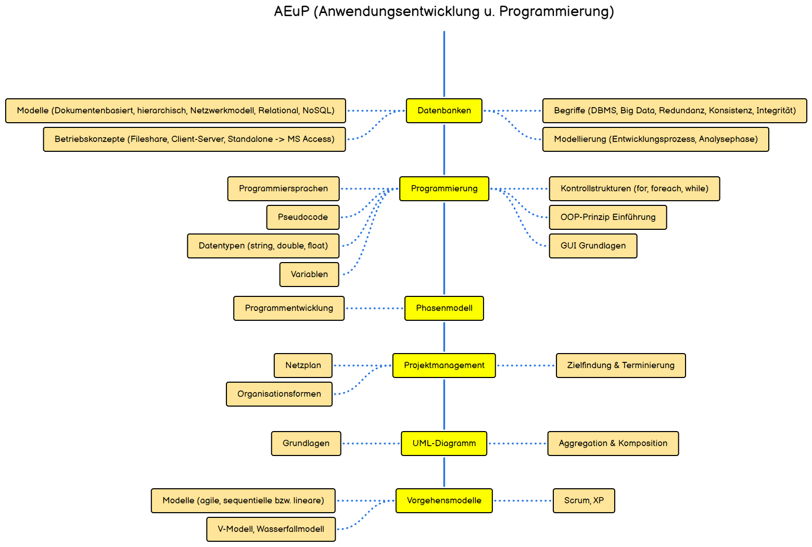

# Fachinformatiker

## Roadmap

> [!TIP]
> Visit the complete roadmap [here](https://roadmap.sh/r/fachinformatiker)

### Elektrotechnik - IT-Technik

| Topic                                   | Description / Link                                                                                                                                                                                                                                                                                                                                         |
| --------------------------------------- | ---------------------------------------------------------------------------------------------------------------------------------------------------------------------------------------------------------------------------------------------------------------------------------------------------------------------------------------------------------- |
| Grundgatter (Logikgatter)               | Elektronische Schaltkreise, die als Grundlage für digitale Schaltungen dienen (z.B. AND, OR).                                                                                                                                                                                                                                                              |
|                                         | [https://www.elektroniktutor.de/digitaltechnik/gatter.html](https://www.elektroniktutor.de/digitaltechnik/gatter.html)                                                                                                                                                                                                                                     |
|                                         | [https://www.khanacademy.org/computing/computers-and-internet/xcae6f4a7ff015e7d:computers/xcae6f4a7ff015e7d:logic-gates-and-circuits/quiz/xcae6f4a7ff015e7d:computers-quiz-1](https://www.khanacademy.org/computing/computers-and-internet/xcae6f4a7ff015e7d:computers/xcae6f4a7ff015e7d:logic-gates-and-circuits/quiz/xcae6f4a7ff015e7d:computers-quiz-1) |
| KV Diagramm (Kamaugh-Veitch - Diagramm) | Ein Werkzeug zur Vereinfachung logischer Schaltungen in der digitalen Technik.                                                                                                                                                                                                                                                                             |
|                                         | [https://www.elektroniktutor.de/digitaltechnik/kvdiagr.html#:~:text=Ein%20KV%2DDiagramm%20ist%20eine,ergeben%20sich%20bereits%20minimierte%20Funktionsgleichungen](https://www.elektroniktutor.de/digitaltechnik/kvdiagr.html#:~:text=Ein%20KV%2DDiagramm%20ist%20eine,ergeben%20sich%20bereits%20minimierte%20Funktionsgleichungen).                      |
| Ampelsteuerung                          |                                                                                                                                                                                                                                                                                                                                                            |
|                                         | [https://www.elektroniktutor.de/regelungstechnik/regelung.html](https://www.elektroniktutor.de/regelungstechnik/regelung.html)                                                                                                                                                                                                                             |
|                                         |                                                                                                                                                                                                                                                                                                                                                            |
| Zahlensysteme                           | Verschiedene numerische Systeme wie Binär, Dezimal, Hexadezimal zur Darstellung von Zahlen.                                                                                                                                                                                                                                                                |
|                                         | [https://studyflix.de/informatik/zahlensysteme-402](https://studyflix.de/informatik/zahlensysteme-402)                                                                                                                                                                                                                                                     |
| Addierer                                |                                                                                                                                                                                                                                                                                                                                                            |
|                                         | [https://inf-schule.de/rechner/digitaltechnik/addierer/einstieg](https://inf-schule.de/rechner/digitaltechnik/addierer/einstieg)                                                                                                                                                                                                                           |

### Hardware & EDV - IT-Technik

| Topic                                  | Description / Link                                                                                                                                                                                                                                                                                                                                                                            |
| -------------------------------------- | --------------------------------------------------------------------------------------------------------------------------------------------------------------------------------------------------------------------------------------------------------------------------------------------------------------------------------------------------------------------------------------------- |
| Grundlagen der EDV                     | Basiswissen über elektronische Datenverarbeitung und die Funktionsweise von Computernetzen.                                                                                                                                                                                                                                                                                                   |
|                                        |                                                                                                                                                                                                                                                                                                                                                                                               |
| Das Mainboard                          | Die zentrale Leiterplatte eines Computers, auf der alle wichtigen Komponenten verbunden sind.                                                                                                                                                                                                                                                                                                 |
|                                        | [https://www.elektronik-kompendium.de/sites/com/0309231.htm](https://www.elektronik-kompendium.de/sites/com/0309231.htm)                                                                                                                                                                                                                                                                      |
| Bus-Systeme                            | Datenübertragungssysteme, die Komponenten eines Computers miteinander verbinden.                                                                                                                                                                                                                                                                                                              |
|                                        | [https://studyflix.de/informatik/bus-system-6108](https://studyflix.de/informatik/bus-system-6108)                                                                                                                                                                                                                                                                                            |
| Die CPU (Central Processing Unit)      | Die zentrale Recheneinheit eines Computers, die alle wichtigen Berechnungen durchführt.                                                                                                                                                                                                                                                                                                       |
|                                        | [https://simpleclub.com/lessons/informatik-prozessor](https://simpleclub.com/lessons/informatik-prozessor)                                                                                                                                                                                                                                                                                    |
|                                        | [https://studyflix.de/informatik/was-ist-cpu-7425](https://studyflix.de/informatik/was-ist-cpu-7425)                                                                                                                                                                                                                                                                                          |
| Speicherarten                          | Unterschiedliche Typen von Datenspeichern wie SSD, HDD, RAM, die für verschiedene Zwecke verwendet werden.                                                                                                                                                                                                                                                                                    |
|                                        | [https://simpleclub.com/lessons/informatik-der-speicher](https://simpleclub.com/lessons/informatik-der-speicher)                                                                                                                                                                                                                                                                              |
|                                        | [https://www.computerweekly.com/de/definition/Speichermedien](https://www.computerweekly.com/de/definition/Speichermedien)                                                                                                                                                                                                                                                                    |
| Gehäuse, Netzteile u. Energieverbrauch | Komponenten eines Computers, die das System schützen und mit Strom versorgen.                                                                                                                                                                                                                                                                                                                 |
|                                        | [https://www.aletoware.com/blog/pc-gehaeuse-kaufen/#:~:text=Das%20PC%2DGeh%C3%A4use%20%C3%BCbernimmt%20vielf%C3%A4ltige,durch%20St%C3%B6%C3%9Fe%2C%20St%C3%BCrze%20und%20Ersch%C3%BCtterungen](https://www.aletoware.com/blog/pc-gehaeuse-kaufen/#:~:text=Das%20PC%2DGeh%C3%A4use%20%C3%BCbernimmt%20vielf%C3%A4ltige,durch%20St%C3%B6%C3%9Fe%2C%20St%C3%BCrze%20und%20Ersch%C3%BCtterungen). |
| Anschlüsse                             | Verschiedene Schnittstellen (HDMI, USB, etc.) und das EVA-Prinzip (Eingabe, Verarbeitung, Ausgabe).                                                                                                                                                                                                                                                                                           |
|                                        | [https://josuweit-it.de/uebersicht-pc-anschluesse/](https://josuweit-it.de/uebersicht-pc-anschluesse/)                                                                                                                                                                                                                                                                                        |
|                                        | [https://support.one.de/faq/content/19/1676/de/welche-externen-anschluesse-gibt-es-an-einem-computer.html](https://support.one.de/faq/content/19/1676/de/welche-externen-anschluesse-gibt-es-an-einem-computer.html)                                                                                                                                                                          |
| Green-IT                               | IT-Praktiken, die auf Nachhaltigkeit und den umweltbewussten Einsatz von Ressourcen abzielen.                                                                                                                                                                                                                                                                                                 |
|                                        | [https://www.ionos.de/digitalguide/hosting/hosting-technik/green-it/](https://www.ionos.de/digitalguide/hosting/hosting-technik/green-it/)                                                                                                                                                                                                                                                    |

### Lizenzen, Datensicherheit (BDSG), Copyright - IT-Technik

| Topic                       | Description / Link                                                                                                                                                                                             |
| --------------------------- | -------------------------------------------------------------------------------------------------------------------------------------------------------------------------------------------------------------- |
| Datensicherheit             | Maßnahmen zum Schutz von Daten vor unbefugtem Zugriff und Verlust.                                                                                                                                             |
|                             | [https://www.datenschutz.org/datensicherheit-massnahmen/](https://www.datenschutz.org/datensicherheit-massnahmen/)                                                                                             |
| Lizenzvereinbarungen        | Rechtliche Vereinbarungen, die die Nutzung von Software oder anderen digitalen Inhalten regeln.                                                                                                                |
|                             | [https://fynk.com/de/glossar/lizenzvereinbarungen/](https://fynk.com/de/glossar/lizenzvereinbarungen/)                                                                                                         |
| Gefahren des el. Stroms     | Risiken, die beim Umgang mit elektrischem Strom bestehen, z.B. durch Kurzschlüsse oder Stromschläge.                                                                                                           |
|                             | [https://www.leifiphysik.de/elektrizitaetslehre/ohmsches-gesetz-kennlinien/ausblick/gefahr-durch-strom](https://www.leifiphysik.de/elektrizitaetslehre/ohmsches-gesetz-kennlinien/ausblick/gefahr-durch-strom) |
| Lizenzarten                 | Verschiedene Lizenzmodelle wie Freeware, Shareware oder Open Source Software.                                                                                                                                  |
|                             | [https://www.erp.de/erp-software/orientierung/softwarelizenzen-definition-und-arten](https://www.erp.de/erp-software/orientierung/softwarelizenzen-definition-und-arten)                                       |
| Schranken des Urheberrechts | Grenzen und Ausnahmen im Urheberrecht, die die Nutzung geschützter Werke betreffen.                                                                                                                            |
|                             | [https://www.urheberrecht.de/schranken-des-urheberrechts/](https://www.urheberrecht.de/schranken-des-urheberrechts/)                                                                                           |
| Schutzziele                 | Ziele der Informationssicherheit, wie Vertraulichkeit, Integrität und Verfügbarkeit von Daten.                                                                                                                 |
|                             | [https://www.rst-beratung.de/themen/informationssicherheit](https://www.rst-beratung.de/themen/informationssicherheit)                                                                                         |

### Netzwerkarchitekturen, USV, OSI Modell - FU-IT

| Topic               | Description / Link                                                                           |
| ------------------- | -------------------------------------------------------------------------------------------- |
| Netzwerkarchitektur | Das Modell, wie Netzwerke strukturiert sind, z.B. Client-Server oder Peer-to-Peer.           |
| USV                 | Unterbrechungsfreie Stromversorgung, die Geräte bei Stromausfällen vor Datenverlust schützt. |
| OSI-Modell          | Ein Schichtenmodell, das die Kommunikation in Netzwerken standardisiert.                     |

### AEuP (Anwendungsentwicklung u. Programmierung)

| Topic             | Description / Link                                                                                              |
| ----------------- | --------------------------------------------------------------------------------------------------------------- |
| Datenbanken       | Systeme zur Speicherung, Verwaltung und Abruf von Daten in verschiedenen Strukturen, wie relational oder NoSQL. |
| Programmierung    | Der Prozess der Erstellung von Software durch Schreiben von Code in Programmiersprachen.                        |
| Phasenmodell      | Ein Modell zur Softwareentwicklung, das die Entwicklung in verschiedene Phasen unterteilt.                      |
| Projektmanagement | Die Planung, Steuerung und Überwachung von Projekten zur Erreichung definierter Ziele.                          |
| UML-Diagramm      | Ein Diagrammtyp, der zur Modellierung von Software und Prozessen verwendet wird.                                |
| Vorgehensmodelle  | Modelle zur Strukturierung von Entwicklungsprozessen, z.B. agil oder Wasserfallmodell.                          |

### Wirtschaft

| Topic                           | Description / Link                                                                                |
| ------------------------------- | ------------------------------------------------------------------------------------------------- |
| Volkswirtschaftliche Grundlagen | Grundlegende Konzepte der Volkswirtschaft wie der Wirtschaftskreislauf und Marktformen.           |
| Unternehmensumfeld              | Die externen Faktoren, die Einfluss auf ein Unternehmen haben, wie Branchen und Zusammenschlüsse. |
| Rechtsformen                    | Verschiedene rechtliche Strukturen eines Unternehmens, wie GmbH oder OHG.                         |
| Organigramme                    | Grafische Darstellungen der Aufbauorganisation eines Unternehmens oder einer Institution.         |

### Politik und Gesellschaft

| Topic                    | Description / Link                                                                                                 |
| ------------------------ | ------------------------------------------------------------------------------------------------------------------ |
| Duales Ausbildungssystem | Ein System der Berufsausbildung, das praktische Arbeit und theoretische Schulbildung kombiniert.                   |
| Sozialpolitik            | Maßnahmen und Regelungen eines Staates zur sozialen Absicherung der Bevölkerung, wie Renten oder Arbeitslosengeld. |
| Wirtschaftspolitik       | Die politischen Maßnahmen zur Steuerung und Stabilisierung der Wirtschaft, z.B. durch das Stabilitätsgesetz.       |

## Educational platforms

| Title                                     | Topic       | Link                                                                                                                                                                       |
| ----------------------------------------- | ----------- | -------------------------------------------------------------------------------------------------------------------------------------------------------------------------- |
| roadmap.sh                                | General     | [https://roadmap.sh/](https://roadmap.sh/)                                                                                                                                 |
| bashcrawl                                 | General     | [https://gitlab.com/slackermedia/bashcrawl](https://gitlab.com/slackermedia/bashcrawl)                                                                                     |
| Filius - Netzwerksimulation               | General     | [https://www.lernsoftware-filius.de/Herunterladen](https://www.lernsoftware-filius.de/Herunterladen)                                                                       |
| Linux Journey                             | General     | [https://linuxjourney.com/](https://linuxjourney.com/)                                                                                                                     |
| Cisco Packet Tracer                       | General     | [https://www.netacad.com/courses/packet-tracer](https://www.netacad.com/courses/packet-tracer)                                                                             |
| WebNetSim - In-Browser Netzwerksimulation | General     | [https://webnetsim.de/](https://webnetsim.de/)                                                                                                                             |
| BASTA!                                    | General     | [https://www.youtube.com/@BastaConference](https://www.youtube.com/@BastaConference)                                                                                       |
| Quantum Computing 101                     | General     | [https://academy.meetiqm.com/curriculum](https://academy.meetiqm.com/curriculum)                                                                                           |
| AWS Educate                               | Cloud       | [https://aws.amazon.com/de/education/awseducate/](https://aws.amazon.com/de/education/awseducate/)                                                                         |
| Google Cloud - Skill Badges               | Cloud       | [https://cloud.google.com/training/badges?hl=de](https://cloud.google.com/training/badges?hl=de)                                                                           |
| W3 Schools - MySql                        | Database    | [https://www.w3schools.com/mysql/](https://www.w3schools.com/mysql/)                                                                                                       |
| SQL-Island                                | Database    | [https://sql-island.informatik.uni-kl.de](https://sql-island.informatik.uni-kl.de)                                                                                         |
| NetworkChuck                              | Influencer  | [https://www.youtube.com/@NetworkChuck](https://www.youtube.com/@NetworkChuck)                                                                                             |
| Raspberry Pi Cloud                        | Influencer  | [https://www.youtube.com/@RaspberryPiCloud](https://www.youtube.com/@RaspberryPiCloud)                                                                                     |
| Programmieren lernen                      | Influencer  | [https://www.youtube.com/@Programmierenlernen](https://www.youtube.com/@Programmierenlernen)                                                                               |
| Noel Lang                                 | Influencer  | [https://www.youtube.com/@NoelLang](https://www.youtube.com/@NoelLang)                                                                                                     |
| The Morpheus Tutorials                    | Influencer  | [https://www.youtube.com/@TheMorpheusTutorials](https://www.youtube.com/@TheMorpheusTutorials)                                                                             |
| Fireship                                  | Influencer  | [https://www.youtube.com/@Fireship](https://www.youtube.com/@Fireship)                                                                                                     |
| Navigio - Jürgen Barth                    | Influencer  | [https://www.youtube.com/@Navigio1](https://www.youtube.com/@Navigio1)                                                                                                     |
| Jeff Geerling                             | Influencer  | [https://www.youtube.com/@JeffGeerling](https://www.youtube.com/@JeffGeerling)                                                                                             |
| the native web                            | Influencer  | [https://www.youtube.com/@thenativeweb](https://www.youtube.com/@thenativeweb)                                                                                             |
| heise & c't                               | Influencer  | [https://www.youtube.com/@heise-ct](https://www.youtube.com/@heise-ct)                                                                                                     |
| c't 3003                                  | Influencer  | [https://www.youtube.com/@ct3003](https://www.youtube.com/@ct3003)                                                                                                         |
| Daniel Medic                              | Influencer  | [https://www.youtube.com/@DanielMedic](https://www.youtube.com/@DanielMedic)                                                                                               |
| wubbl0rz / m4xFPS                         | Influencer  | [https://wubbl0rz.tv](https://wubbl0rz.tv)                                                                                                                                 |
| pwn.college                               | IT-Security | [https://pwn.college/dojos](https://pwn.college/dojos)                                                                                                                     |
| Hak5                                      | IT-Security | [https://shop.hak5.org](https://shop.hak5.org)                                                                                                                             |
| The Morpheus Tutorials - C#               | Coding      | [https://www.youtube.com/watch?v=podkKm7HsY8&list=PLNmsVeXQZj7rlNexPh8wjI2DyABX8It7U](https://www.youtube.com/watch?v=podkKm7HsY8&list=PLNmsVeXQZj7rlNexPh8wjI2DyABX8It7U) |
| ProgrammierenLernen24 - C#                | Coding      | [https://www.programmierenlernen24.de/csharp-erste-schritte-programmierung/](https://www.programmierenlernen24.de/csharp-erste-schritte-programmierung/)                   |
| Build it with .NET                        | Coding      | [https://dotnet.microsoft.com/en-us/](https://dotnet.microsoft.com/en-us/)                                                                                                 |
| W3 Schools - C#                           | Coding      | [https://www.w3schools.com/cs/index.php](https://www.w3schools.com/cs/index.php)                                                                                           |
| Leetcode Problems                         | Coding      | [https://leetcode.com/problemset/?difficulty=EASY&page=1](https://leetcode.com/problemset/?difficulty=EASY&page=1)                                                         |
| CodeChef C#                               | Coding      | [https://www.codechef.com/learn/course/c-sharp](https://www.codechef.com/learn/course/c-sharp)                                                                             |
| SelfHtml                                  | Coding      | [https://wiki.selfhtml.org](https://wiki.selfhtml.org)                                                                                                                     |
| CSS-Tricks                                | Coding      | [https://css-tricks.com](https://css-tricks.com)                                                                                                                           |
| Type-Level-Typescript                     | Coding      | [https://type-level-typescript.com](https://type-level-typescript.com)                                                                                                     |
| IT-Berufe-Podcast                         | Podcast     | [https://it-berufe-podcast.de](https://it-berufe-podcast.de)                                                                                                               |
| Programmier.bar                           | Podcast     | [https://www.programmier.bar](https://www.programmier.bar)                                                                                                                 |
| Rheinwerk Openbook                        | Book        | [https://www.rheinwerk-verlag.de/openbook](https://www.rheinwerk-verlag.de/openbook)                                                                                       |
| dpunkt Openbooks                          | Book        | [https://dpunkt.de/openbooks](https://dpunkt.de/openbooks)                                                                                                                 |
| EbookFoundation free-programming-books    | Book        | [https://github.com/EbookFoundation/free-programming-books](https://github.com/EbookFoundation/free-programming-books)                                                     |

> [!TIP]
> If you're interested in useful software, take a look at my [TechToolkit](https://github.com/JG2401/TechToolkit)