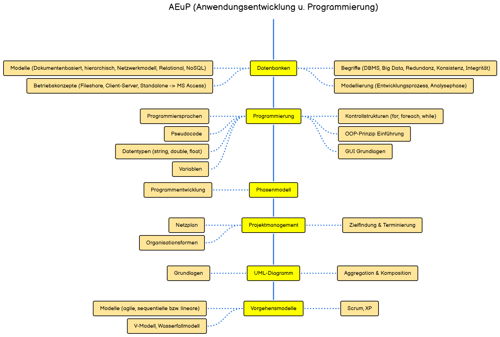

# Fachinformatiker

## Roadmap

## Ausbildungsjahre

- [Ausbildungsjahr 1](Ausbildungsjahr1/README.md)
- [Ausbildungsjahr 2](Ausbildungsjahr2/README.md)
- [Ausbildungsjahr 3 - Anwendungsentwicklung](Ausbildungsjahr3_awe/README.md)
- [Ausbildungsjahr 3 - Systemintegration](Ausbildungsjahr3_sys/README.md)

## Educational platforms

| Title                                     | Topic       | Link                                                                                                                                                                       |
| ----------------------------------------- | ----------- | -------------------------------------------------------------------------------------------------------------------------------------------------------------------------- |
| roadmap.sh                                | General     | [https://roadmap.sh/](https://roadmap.sh/)                                                                                                                                 |
| bashcrawl                                 | General     | [https://gitlab.com/slackermedia/bashcrawl](https://gitlab.com/slackermedia/bashcrawl)                                                                                     |
| Filius - Netzwerksimulation               | General     | [https://www.lernsoftware-filius.de/Herunterladen](https://www.lernsoftware-filius.de/Herunterladen)                                                                       |
| Linux Journey                             | General     | [https://linuxjourney.com/](https://linuxjourney.com/)                                                                                                                     |
| Cisco Packet Tracer                       | General     | [https://www.netacad.com/courses/packet-tracer](https://www.netacad.com/courses/packet-tracer)                                                                             |
| WebNetSim - In-Browser Netzwerksimulation | General     | [https://webnetsim.de/](https://webnetsim.de/)                                                                                                                             |
| BASTA!                                    | General     | [https://www.youtube.com/@BastaConference](https://www.youtube.com/@BastaConference)                                                                                       |
| Quantum Computing 101                     | General     | [https://academy.meetiqm.com/curriculum](https://academy.meetiqm.com/curriculum)                                                                                           |
| AWS Educate                               | Cloud       | [https://aws.amazon.com/de/education/awseducate/](https://aws.amazon.com/de/education/awseducate/)                                                                         |
| Google Cloud - Skill Badges               | Cloud       | [https://cloud.google.com/training/badges?hl=de](https://cloud.google.com/training/badges?hl=de)                                                                           |
| W3 Schools - MySql                        | Database    | [https://www.w3schools.com/mysql/](https://www.w3schools.com/mysql/)                                                                                                       |
| SQL-Island                                | Database    | [https://sql-island.informatik.uni-kl.de](https://sql-island.informatik.uni-kl.de)                                                                                         |
| NetworkChuck                              | Influencer  | [https://www.youtube.com/@NetworkChuck](https://www.youtube.com/@NetworkChuck)                                                                                             |
| Raspberry Pi Cloud                        | Influencer  | [https://www.youtube.com/@RaspberryPiCloud](https://www.youtube.com/@RaspberryPiCloud)                                                                                     |
| Programmieren lernen                      | Influencer  | [https://www.youtube.com/@Programmierenlernen](https://www.youtube.com/@Programmierenlernen)                                                                               |
| Noel Lang                                 | Influencer  | [https://www.youtube.com/@NoelLang](https://www.youtube.com/@NoelLang)                                                                                                     |
| The Morpheus Tutorials                    | Influencer  | [https://www.youtube.com/@TheMorpheusTutorials](https://www.youtube.com/@TheMorpheusTutorials)                                                                             |
| Fireship                                  | Influencer  | [https://www.youtube.com/@Fireship](https://www.youtube.com/@Fireship)                                                                                                     |
| Navigio - Jürgen Barth                    | Influencer  | [https://www.youtube.com/@Navigio1](https://www.youtube.com/@Navigio1)                                                                                                     |
| Jeff Geerling                             | Influencer  | [https://www.youtube.com/@JeffGeerling](https://www.youtube.com/@JeffGeerling)                                                                                             |
| the native web                            | Influencer  | [https://www.youtube.com/@thenativeweb](https://www.youtube.com/@thenativeweb)                                                                                             |
| heise & c't                               | Influencer  | [https://www.youtube.com/@heise-ct](https://www.youtube.com/@heise-ct)                                                                                                     |
| c't 3003                                  | Influencer  | [https://www.youtube.com/@ct3003](https://www.youtube.com/@ct3003)                                                                                                         |
| Daniel Medic                              | Influencer  | [https://www.youtube.com/@DanielMedic](https://www.youtube.com/@DanielMedic)                                                                                               |
| wubbl0rz / m4xFPS                         | Influencer  | [https://wubbl0rz.tv](https://wubbl0rz.tv)                                                                                                                                 |
| pwn.college                               | IT-Security | [https://pwn.college/dojos](https://pwn.college/dojos)                                                                                                                     |
| Hak5                                      | IT-Security | [https://shop.hak5.org](https://shop.hak5.org)                                                                                                                             |
| The Morpheus Tutorials - C#               | Coding      | [https://www.youtube.com/watch?v=podkKm7HsY8&list=PLNmsVeXQZj7rlNexPh8wjI2DyABX8It7U](https://www.youtube.com/watch?v=podkKm7HsY8&list=PLNmsVeXQZj7rlNexPh8wjI2DyABX8It7U) |
| ProgrammierenLernen24 - C#                | Coding      | [https://www.programmierenlernen24.de/csharp-erste-schritte-programmierung/](https://www.programmierenlernen24.de/csharp-erste-schritte-programmierung/)                   |
| Build it with .NET                        | Coding      | [https://dotnet.microsoft.com/en-us/](https://dotnet.microsoft.com/en-us/)                                                                                                 |
| W3 Schools - C#                           | Coding      | [https://www.w3schools.com/cs/index.php](https://www.w3schools.com/cs/index.php)                                                                                           |
| Leetcode Problems                         | Coding      | [https://leetcode.com/problemset/?difficulty=EASY&page=1](https://leetcode.com/problemset/?difficulty=EASY&page=1)                                                         |
| CodeChef C#                               | Coding      | [https://www.codechef.com/learn/course/c-sharp](https://www.codechef.com/learn/course/c-sharp)                                                                             |
| SelfHtml                                  | Coding      | [https://wiki.selfhtml.org](https://wiki.selfhtml.org)                                                                                                                     |
| CSS-Tricks                                | Coding      | [https://css-tricks.com](https://css-tricks.com)                                                                                                                           |
| Type-Level-Typescript                     | Coding      | [https://type-level-typescript.com](https://type-level-typescript.com)                                                                                                     |
| IT-Berufe-Podcast                         | Podcast     | [https://it-berufe-podcast.de](https://it-berufe-podcast.de)                                                                                                               |
| Programmier.bar                           | Podcast     | [https://www.programmier.bar](https://www.programmier.bar)                                                                                                                 |
| Rheinwerk Openbook                        | Book        | [https://www.rheinwerk-verlag.de/openbook](https://www.rheinwerk-verlag.de/openbook)                                                                                       |
| dpunkt Openbooks                          | Book        | [https://dpunkt.de/openbooks](https://dpunkt.de/openbooks)                                                                                                                 |
| EbookFoundation free-programming-books    | Book        | [https://github.com/EbookFoundation/free-programming-books](https://github.com/EbookFoundation/free-programming-books)                                                     |

> [!TIP]
> If you're interested in useful software, take a look at my [TechToolkit](https://github.com/JG2401/TechToolkit)